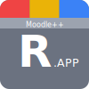

<h1 style="text-align:center"><a href="https://moodle-plus-plus.vercel.app/">Moodle++</a></h1>

<p style="text-align: center">
  
  <br>
  <br>
  <i>Moodle++ is a modern recreation of the Moodle LMS, <br> 
Leveraging faster technologies to simplify course management and enhance the learning experience.
    <br>
 <br>
</i>
</p>
<p style="text-align: center">
  
  
    
  
  

[//]: # ()
[//]: # (<p style="text-align: center"><i>A web application, written using <a href="https://github.com/angular/angular">Angular</a> in <a href="https://en.wikipedia.org/wiki/HTML5">HTML5</a>, <a href="https://en.wikipedia.org/wiki/CSS">CSS3</a>, and <a href="https://typescriptlang.org">TypeScript</a> that allows users to book flights, check their flight status, and manage their account</i></p>)

[//]: # (<p style="text-align: center"><i>A REST API, written using <a href="https://github.com/expressjs/express">Express</a> in <a href="https://typescriptlang.org">TypeScript</a> that allows the web application to communicate with the database. </i></p>)

[//]: # (<p style="text-align: center"><i>An <a href="">SQL</a> database schema, that stores all the data needed for the airline. </i></p>)

[//]: # ()

## Table of Contents

- [Table of Contents](#table-of-contents)
    - [Getting Started](#getting-started)
      - [Requirements](#requirements)
      - [Installation](#installation)
      - [Configuration](#configuration)
      - [Running the Application](#running-the-application)
    - [Features](#features)
    - [License](#license)

    
## Getting Started

### Requirements

* Node.js (version 20 or higher)
* npm (version 7 or higher)
* 2 MySQL-compatible databases (one for the live version and one for schema updates)
* Access to an S3-compatible object storage service (e.g. AWS S3, Cloudflare R2)
* GitHub [Oauth2 application credentials](https://docs.github.com/en/apps/oauth-apps/building-oauth-apps/authorizing-oauth-apps)


### Installation

```bash
git clone https://github.com/bog1200/Moodle_plus_plus.git
cd Moodle_plus_plus
npm install .
```

### Configuration
The application requires a `.env` file in the root directory of the project for the environment variables such as the database connection. The `.env` file should contain the following variables:
```env
# JDBC URL for the database
DATABASE_URL=
# JDBC URL for the shadow database
SHADOW_DATABASE_URL=
# The secret used to sign the JWT tokens
AUTH_SECRET=

# The client ID and secret for the GitHub OAuth2 application (required)
AUTH_GITHUB_ID=
AUTH_GITHUB_SECRET=

# The client ID and secret for the Romail.app OAuth2 application (optional)
AUTH_ROMAILSSO_ID=
AUTH_ROMAILSSO_SECRET=

# The S3 bucket and endpoint for file uploads
S3_ACCESS_KEY_ID=
S3_SECRET_ACCESS_KEY=
S3_ENDPOINT=
S3_BUCKET=

# Default File Upload limit: 50MB
NEXT_PUBLIC_FILE_UPLOAD_MAX_SIZE=52428800
```

A sample file is also provided in the repository as [.env.sample](.env.sample).

### Running the Application

You can run the application using the following command:

```bash
npm run dev
```

The application will be available at `http://localhost:3000/`.

### Features

* **Course Management**: Instructors can create and manage courses, add assignments, and grade students.
* **Assignment Submission**: Students can submit assignments and view their grades.
* **File Management System**: Users can upload files to the platform and share them with others.
* **User Role and Permissions**: Different roles have different permissions, such as instructors being able to grade assignments.
* **Authentication**: Users can sign in using GitHub OAuth2 or Romail.app SSO.

## License

This project is licensed under the [GNU General Public License v3.0](LICENSE).


